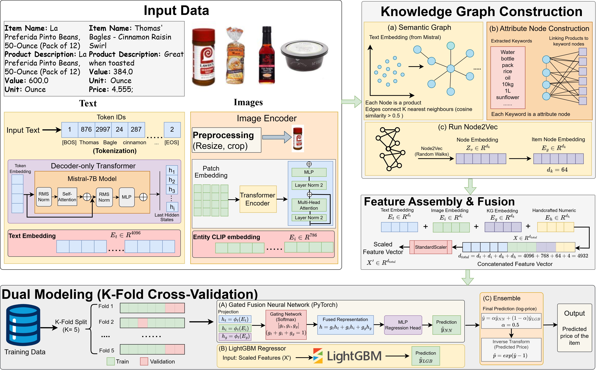

# Multimodal Pricing Prediction Model

This repository contains a multimodal machine learning pipeline that combines text embeddings (Mistral-7B), image embeddings (CLIP), and Knowledge Graph embeddings (Node2Vec) to predict pricing. 

## Pipeline Overview
1. **Preprocessing**: Extracts item package quantities (IPQ) and calculates text statistics.
2. **Embeddings**: Loads pre-computed Mistral-7B and CLIP embeddings.
3. **Knowledge Graph**: Constructs a semantic KNN graph and extracts attributes using TF-IDF, then embeds nodes using Node2Vec.
4. **Fusion & Training**: Concatenates all modalities and trains both a PyTorch Neural Network and a LightGBM model.

The proposed architecture is shown in the figure below:

